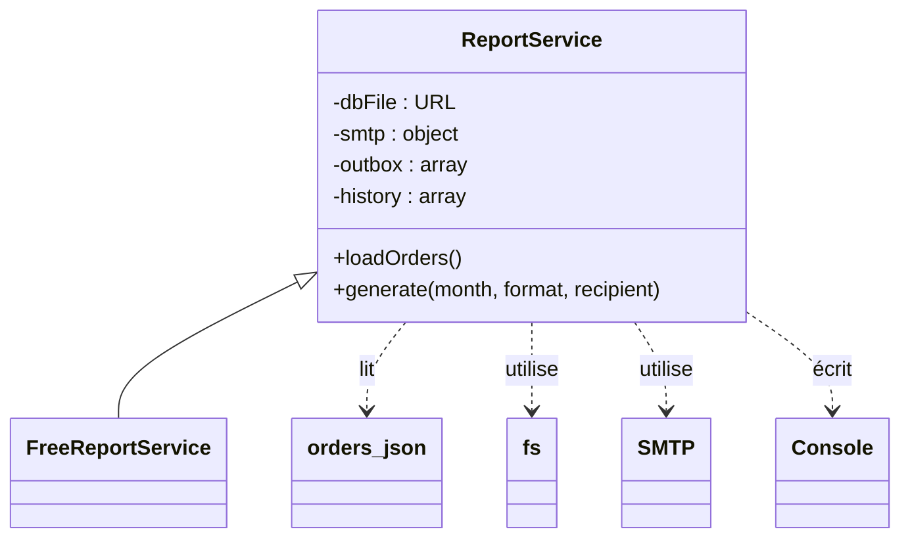
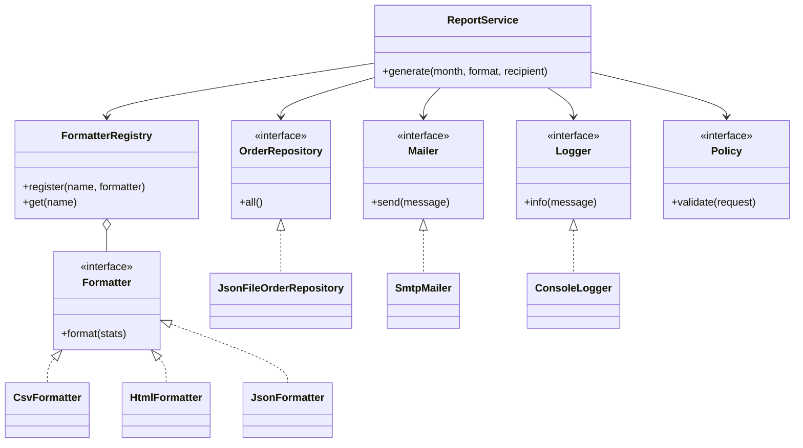

# Diagrammes d’architecture

## Avant refactoring

```mermaid
classDiagram
class ReportService {
  -dbFile : URL
  -smtp : object
  -outbox : array
  -history : array
  +loadOrders()
  +generate(month, format, recipient)
}
class FreeReportService
ReportService <|-- FreeReportService
ReportService ..> orders_json : lit
ReportService ..> fs : utilise
ReportService ..> SMTP : utilise
ReportService ..> Console : écrit
```

## Après refactoring

```mermaid
classDiagram
class ReportService {
  +generate(month, format, recipient)
}
class OrderRepository {
  <<interface>>
  +all()
}
class FormatterRegistry {
  +register(name, formatter)
  +get(name)
}
class Formatter {
  <<interface>>
  +format(stats)
}
class Mailer {
  <<interface>>
  +send(message)
}
class Logger {
  <<interface>>
  +info(message)
}
class Policy {
  <<interface>>
  +validate(request)
}
class JsonFileOrderRepository
class SmtpMailer
class ConsoleLogger
class CsvFormatter
class HtmlFormatter
class JsonFormatter
ReportService --> OrderRepository
ReportService --> FormatterRegistry
ReportService --> Mailer
ReportService --> Logger
ReportService --> Policy
OrderRepository <|.. JsonFileOrderRepository
Mailer <|.. SmtpMailer
Logger <|.. ConsoleLogger
Formatter <|.. CsvFormatter
Formatter <|.. HtmlFormatter
Formatter <|.. JsonFormatter
FormatterRegistry o-- Formatter
```
